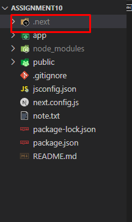
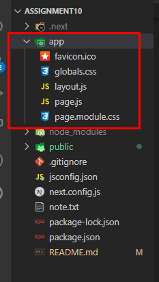

## What is Next JS?

Next.js is a popular open-source JavaScript framework used for building modern web applications and websites. It is specifically designed for server-side rendering (SSR) and static site generation (SSG) of React applications. Next.js provides a set of tools and features that simplify the development of performant and SEO-friendly web applications.

# Description of the folder structure used in the project.

## This Next.js starter project setup without Tailwind CSS and SRC file

### Now I will describe folder structure of the project!

# 1. .next folder

At first, when we run the project with command `npm run dev` or `npm run build` then a .next building folder has created.

The .next folder in a Next.js project is where the compiled and optimized assets are stored after building the application. It contains subdirectories for static assets, server-side code, compiled pages, and JavaScript chunks. This folder is crucial for running a Next.js application in production, as it holds everything needed for server-side rendering, client-side routing, and asset management.

# 2. app directory / folder

The app directory/folder in a Next.js project contains the application code. This includes the pages, components, and other files that make up the application. The app directory is important because it is the main entry point for the application. When Next.js starts, it will look for the app directory and load the files in that directory.

### Creating directories

Next.js uses file-system routing, which means the routes in your application are determined by how you structure your files.

### The app directory

For new applications, we recommend using the App Router. This router allows you to use React's latest features and is an evolution of the Pages Router based on community feedback.

In the app folder/directory we need some major files like layout.js, page.js, global.css and many more.

In this project have variety of files that are commonly found in a Next.js application to enhance its functionality and appearance:

`favicon.io`: This file is used to create a favicon for the application. A favicon is a small icon that appears in the address bar of the browser.

`global.css`: This file contains global CSS styles that are applied to all pages in the application.

`layout.js`: This file contains the layout for the application. The layout is the HTML structure that is used for all pages in the application. This is the main file of the application.

`page.js`: This file is a page component that renders the content of the / route. The / route is the root route of the application. This is the page that users will see when they first visit the application.

`page.module.css`: The page.module.css file contains CSS styles for the page.js file. CSS modules are a way to scope CSS styles to a specific component or file. This can help to prevent CSS conflicts.

# 3. node_modules directory / folder

In a Next.js app (or any Node.js project), the node_modules directory stores external packages and libraries that your project depends on. It ensures isolation, version management, and easy access to the required code. This directory is essential for managing dependencies and enhancing your project's functionality without manual handling. `package.json:` This file contains information about the package, such as its name, version, and dependencies.

# 4. node_modules directory / folder

In a Next.js app, the public directory (or folder) is used to store static assets that you want to be directly accessible to the client without being processed by Webpack or other build tools. These assets can include images, fonts, videos, and other files that are used in your application.

# 5 `.gitignore` Git files and folders to ignore

# 6 `jsconfig.json` Configuration file for JavaScript

# 7 `next.config.js` Configuration file for Next.js

# 8 `package-lock.json ` In a Next.js app (or any Node.js project), the package-lock.json file tracks and locks down the specific versions of installed packages and their dependencies. It ensures consistency, stability, and reproducibility across different environments, helping to prevent unintentional updates and ensuring reliable builds.

# 9 `package.json` Project dependencies and scripts

# 10 `README.md` the README.md file serves as a documentation hub. It provides a concise overview of the project's purpose, installation instructions, usage examples, contributing guidelines, licensing details, contact information, and other relevant resources. It's the first point of reference for anyone exploring your project on platforms like GitHub.
